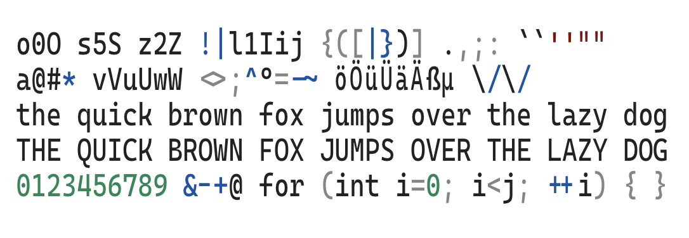

# CasmataPro

A condensed version of [Cascadia Code PL](https://github.com/microsoft/cascadia-code) made to feel like [PragmataPro](https://fsd.it/shop/fonts/pragmatapro/).

## The story

You know I'm a huge fan of `PragmataPro`. And want more fonts like it, but maybe even tiny better. But it's hard... `PragmataPro` is so readable while being so condensed! Second most readable font in my list is `Cascadia Code`, but it is too wide unfortunately, so I dismissed it from my daily use...

And suddenly while browsing internet I have found this [blog post](https://horstmann.com/unblog/2010-11-22/fonts.html) from a fellow condensed fonts lover. With the simple script he turned out already great (but so wide) "DejaVu Sans Mono" font into absolutely amazing "DejaVu Sans Mono Condensed"! I got to try it too!

And it worked surprisingly well! Automatic condensing is not perfect by any mean, but apart of several glyphs that could be improved, everything is very much on its places:

* font is crisp and contast;
* ligatures are working;
* original stylistic sets are exposed;

Try it yourself!
